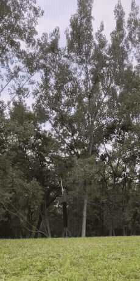
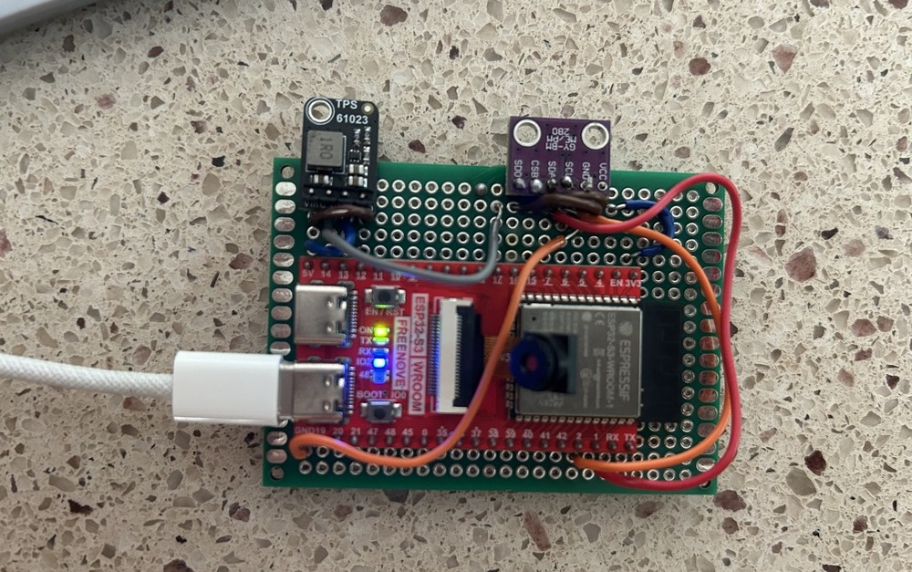
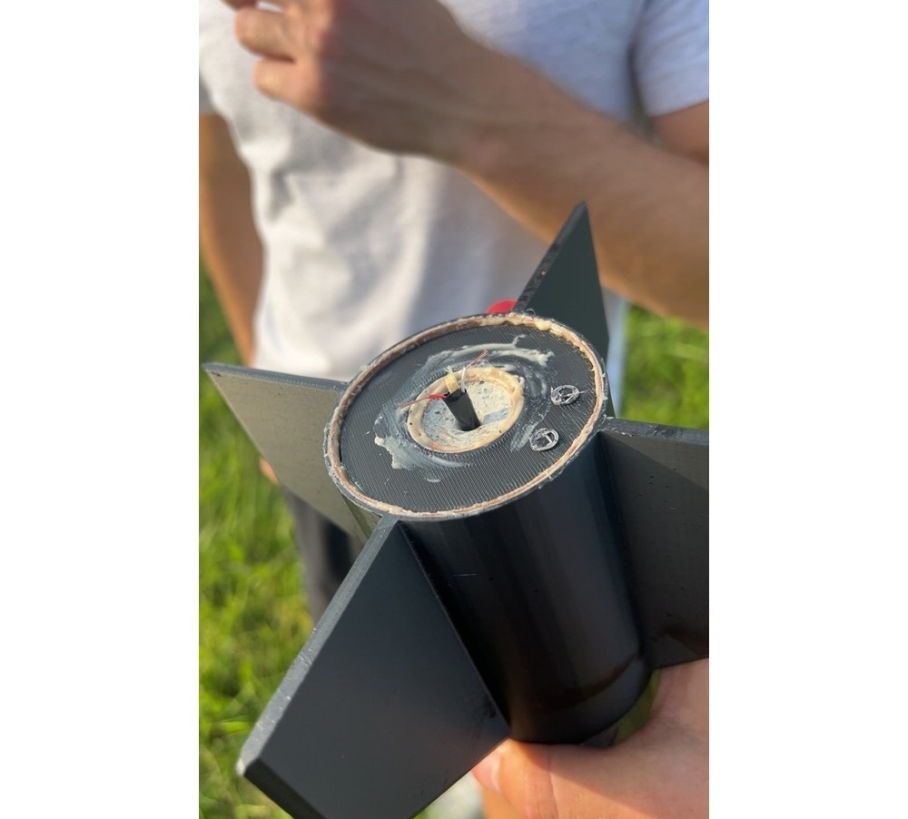
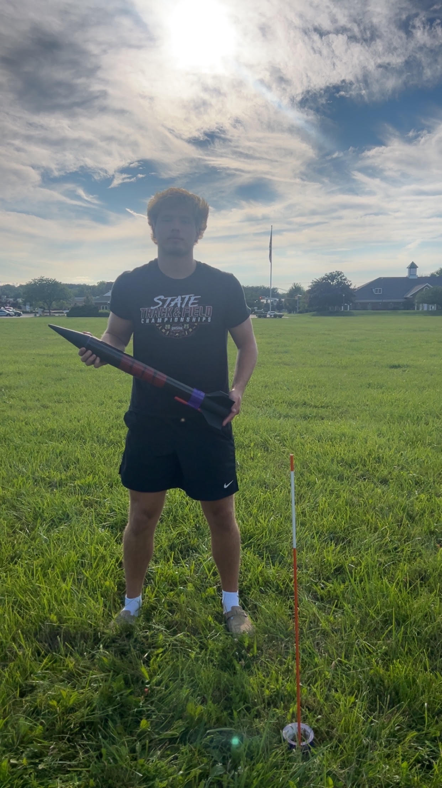
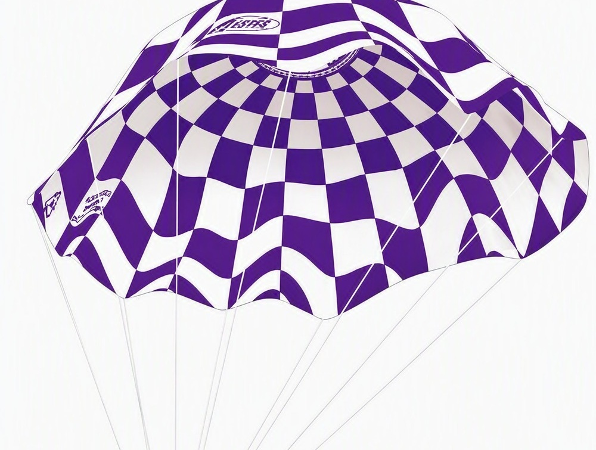
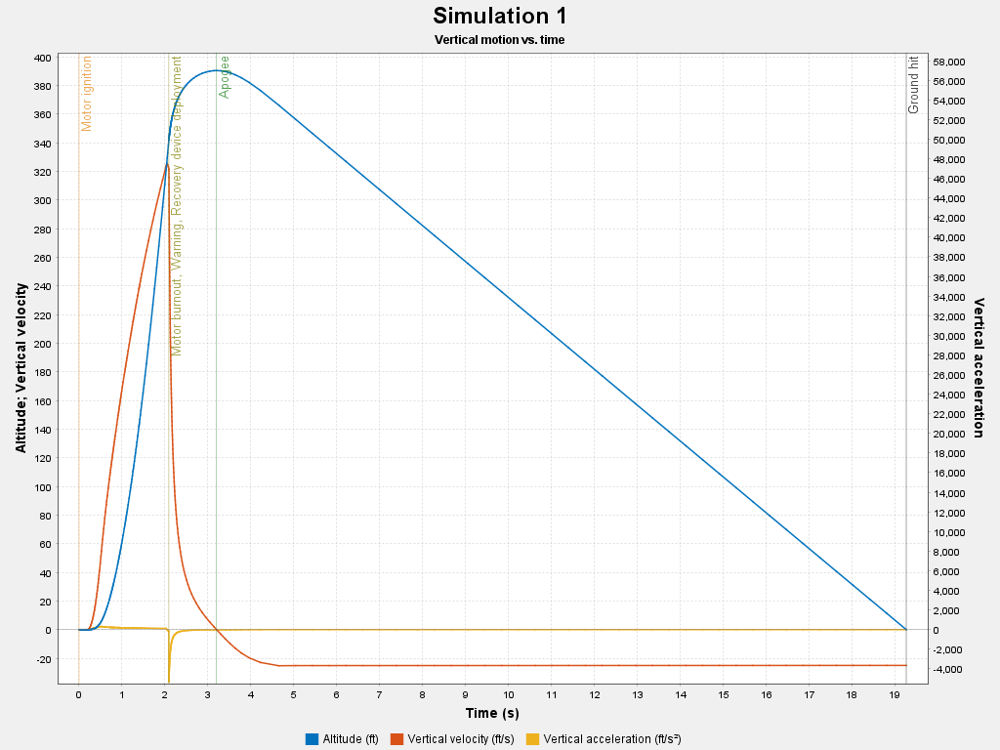
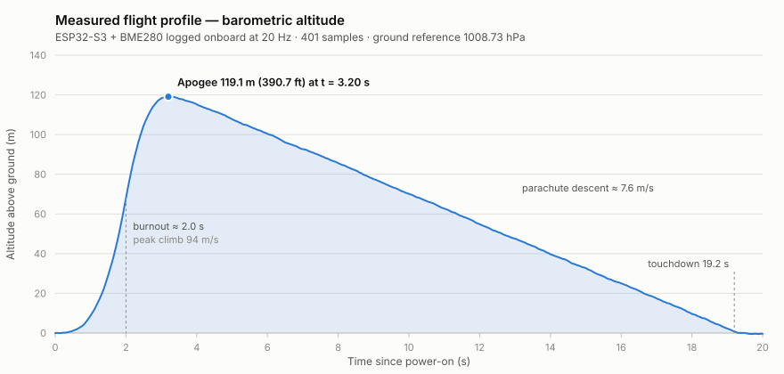
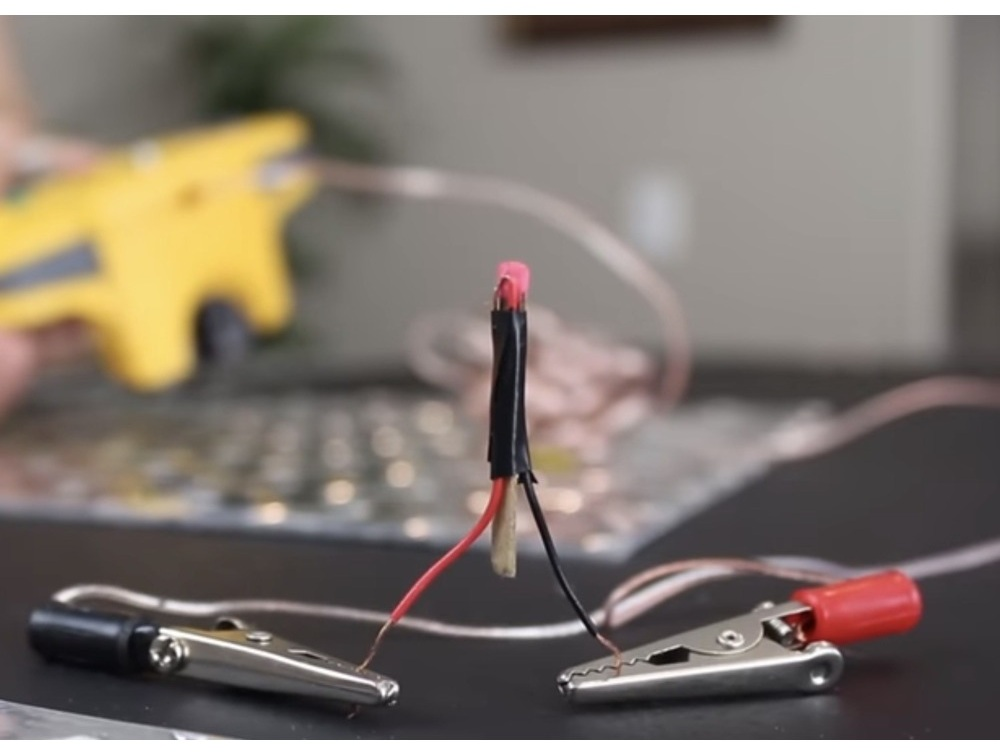
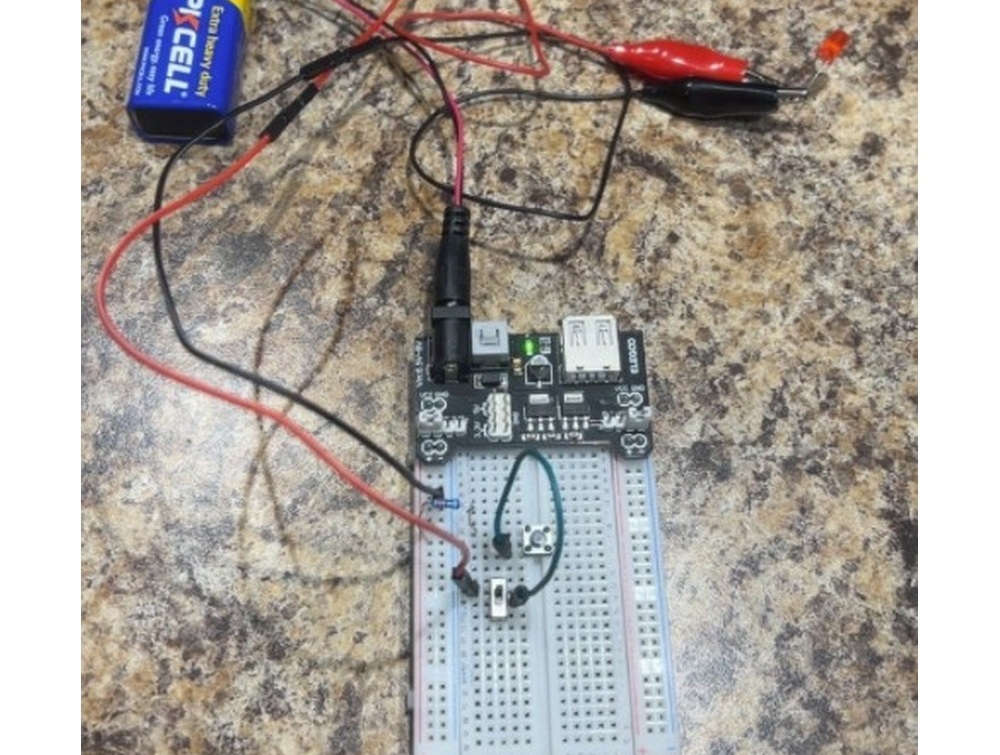
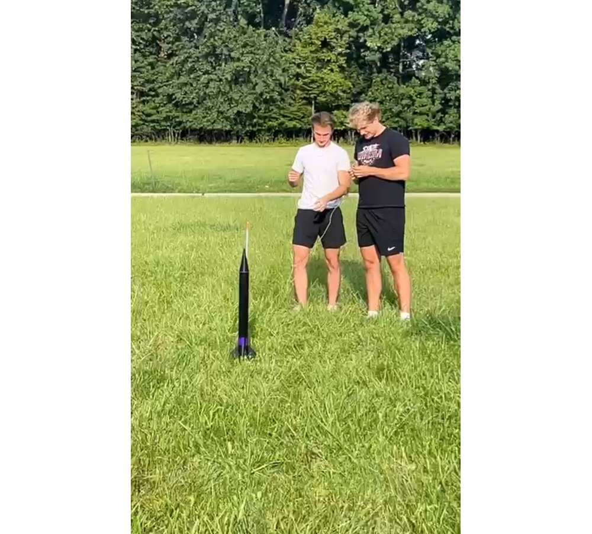

# Model Rocket & ESP32 Flight Computer

A model rocket built from scratch around a custom ESP32-S3 flight computer that logs
barometric altitude, pressure, and temperature to onboard flash at 20 Hz.

The project covers the full build: airframe design in OpenRocket, custom fins, nose cone,
and launch-rail hardware modeled in SOLIDWORKS and 3D printed, firmware written in
Arduino/C++, a homemade igniter and safety-interlock launch controller, and flight testing.

**It flew, the log was recovered, and the measured apogee — 119.1 m (390.7 ft) — matched the
pre-flight OpenRocket prediction to within 0.2%.**



---

## Flight Computer



| Part | Role |
| --- | --- |
| ESP32-S3 WROOM (Freenove) | Main controller, onboard LittleFS flash storage |
| BME280 (I²C, `0x76`) | Barometric pressure, temperature, derived altitude |
| TPS61023 boost converter | Steps battery voltage up to the board's power rail |
| Perfboard + soldered harness | Flight-ready wiring, no breadboard jumpers |

Wiring is I²C on `SDA = GPIO21`, `SCL = GPIO22`.

### Firmware

[`firmware/Flight_Computer_Program/Flight_Computer_Program.ino`](firmware/Flight_Computer_Program/Flight_Computer_Program.ino)

On boot the firmware averages 10 pressure samples to establish a ground baseline, opens the
next unused `flight_N.csv` on LittleFS, and logs continuously:

- **20 Hz sampling** (50 ms interval), pressure oversampled ×16 for resolution
- **Altitude** derived from the barometric formula against the ground baseline
- **Flushed to flash every second**, so an unexpected power loss costs at most 1 s of data
- **Auto-incrementing flight files** — a new log per power cycle, nothing overwritten

Logged columns: `time_ms, pressure_hPa, temperature_C, altitude_m`

### Serial commands

Connect at **115200 baud** and send a single character:

| Key | Action |
| --- | --- |
| `L` | List stored flight logs and flash usage |
| `D` | Dump all logs over serial for retrieval |
| `W` | Erase all logs |
| `S` | Pause / resume logging |

### Building

Requires the ESP32 board support package plus the `Adafruit_BME280` and `Adafruit_Sensor`
libraries. Open the sketch folder in the Arduino IDE, select an ESP32-S3 board, and upload.

---

## Mechanical Design

Custom components were modeled in SOLIDWORKS and 3D printed. Sources are in
[`cad/solidworks/`](cad/solidworks/), print-ready meshes in [`cad/stl/`](cad/stl/).

| Component | SOLIDWORKS | STL |
| --- | --- | --- |
| Fin can | [RocketFins.SLDPRT](cad/solidworks/RocketFins.SLDPRT) | [RocketFins.STL](cad/stl/RocketFins.STL) |
| Nose cone | [NoseCone.SLDPRT](cad/solidworks/NoseCone.SLDPRT) | [NoseCone.STL](cad/stl/NoseCone.STL) |
| Launch-rail clamp | [RocketClamp.SLDPRT](cad/solidworks/RocketClamp.SLDPRT) | [RocketClamp.STL](cad/stl/RocketClamp.STL) |



The finished airframe — 3D-printed fin can, nose cone, and painted body tube:

<table>
  <tr>
    <td align="center">
      <br>
      <sub>Adriano with the completed rocket</sub>
    </td>
    <td align="center">
      <br>
      <sub>Luke at the pad before launch</sub>
    </td>
  </tr>
</table>

Recovery is a parachute deployed by the motor's ejection charge.




---

## Simulation

[`simulation/RocketProject.ork`](simulation/RocketProject.ork) — OpenRocket model used to size
the airframe and predict the flight profile.



| Predicted | Value |
| --- | --- |
| Apogee | 390 ft |
| Time to apogee | 3.2 s |
| Total flight time | 19.3 s |
| Peak velocity | 327 ft/s |
| Peak acceleration | 317 ft/s² |

[`simulation/synthetic_flight_log.xlsx`](simulation/synthetic_flight_log.xlsx) is a phase-labeled
dataset generated from this simulation — not measured telemetry, and marked
`Data_Source = SYNTHETIC_SIMULATION` in the file itself. The real flight log is
[`data/flight_data.csv`](data/flight_data.csv) below.

---

## Measured Flight Data

[`data/flight_data.csv`](data/flight_data.csv) — **401 samples recovered from the flight
computer's flash after the launch.** Twenty seconds of pressure, temperature, and derived
altitude at a steady 20 Hz, exactly as the firmware wrote them.

<picture>
  <source media="(prefers-color-scheme: dark)" srcset="data/flight-profile-dark.svg">
  
</picture>

| Measurement | Value |
| --- | --- |
| Apogee | **119.1 m (390.7 ft)** at t = 3.20 s |
| Peak climb rate | 94 m/s (307 ft/s) at t ≈ 2.0 s |
| Descent rate under parachute | 7.6 m/s (24.8 ft/s) |
| Touchdown | t = 19.2 s |
| Pressure swing | 1008.79 → 994.57 hPa |
| Temperature | 24.80 °C on the pad → 24.32 °C at apogee |
| Sensor noise on the ground | ±0.2 m |

### Measured vs. predicted

The OpenRocket model was built before the flight. Comparing it against what the rocket
actually did is the real result here:

| | Predicted | Measured | Difference |
| --- | --- | --- | --- |
| Apogee | 390 ft | 390.7 ft | +0.2% |
| Time to apogee | 3.2 s | 3.20 s | — |
| Total flight time | 19.3 s | 19.2 s | −0.5% |
| Peak velocity | 327 ft/s | 307 ft/s | −6% |

Apogee and timing matched the simulation to within a fraction of a percent. The velocity gap
is expected: the flight computer carries no accelerometer, so climb rate is finite-differenced
from barometric altitude, which lags during the ~2 s burn and smooths the true peak.

The ±0.2 m spread in the pre-launch and post-landing samples is the practical altitude
resolution of the BME280 at this configuration — small enough that a 119 m apogee is resolved
to better than 0.2%.

---

## Launch System




A hand-built nichrome igniter fired from a 9 V controller with a **two-stage safety
interlock** — an arming switch in series with a momentary launch button, so the igniter
cannot be energized by a single accidental press.



---

## Documentation

- [Project report](docs/rocket-flight-computer-report.pdf) — written write-up of the design and build
- [Photo report](docs/rocket-flight-computer-photo-report.pdf) — illustrated build documentation

---

## Repository Structure

```text
.
├── firmware/
│   └── Flight_Computer_Program/     Arduino sketch (ESP32-S3 + BME280 logger)
├── cad/
│   ├── solidworks/                  Editable SOLIDWORKS parts
│   └── stl/                         Print-ready meshes
├── simulation/                      OpenRocket model, predicted profile, synthetic dataset
├── data/                            Measured flight log (CSV) + rendered profile
├── docs/                            Project reports (PDF)
└── media/                           Launch footage and build photos
```

---

## Skills

Embedded C++ · ESP32 · I²C sensor integration · onboard data logging · flight-data analysis ·
simulation validation · SOLIDWORKS · 3D printing · OpenRocket · circuit prototyping and
soldering · flight testing

---

## Status

**Complete and flight-validated.** The airframe, avionics, and launch system were built,
flown, and recovered, and the onboard log was pulled from flash after the flight — the
measured apogee matched the pre-flight simulation to within 0.2%.

---

## Authors

Built as a two-person team project by **Adriano Zagar** and **Luke Schreiber**.
